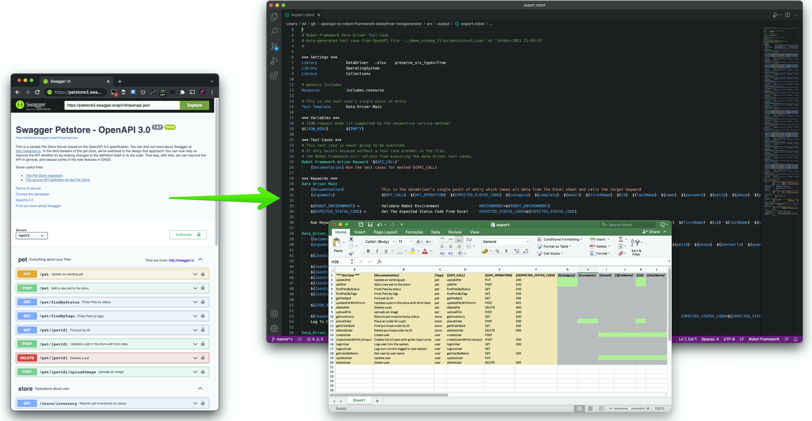

# openapi-to-robot-framework-datadriver-testgenerator

This program generates a full-fledged Excel-based Robot Framework Datadriver test case from an OpenAPI file.

## Features
  
- Supports OpenAPI V3 YAML and JSON input file formats. V2 file format support can be achieved through library reconfiguration.
- The program will read a valid OpenAPI file and then tries to generate the following output files for you:
  - A Robot Framework test file, containing all tests that are associated with this OpenAPI file
  - A generic RF 'include' file
  - An Excel file which will be used by the Robot Framework test as input data
  - Optional: generate Jira / XRay Test / Test Exceution tickets and associate them with the Robot Framework test
- All input data is template-based, meaning that you can apply simple modifications to Jira / Robot template files which will then represent the foundation for the future Excel/Robot test file

## Excel features

- For each API call, the program will try to determine the supported optional and required parameters for the request body:
  - __Red__ fields indicate a mandatory parameter
  - __Green__ fields indicate optional parameters
  - __Grey__ fields indicate fields which are not supported for this API call
- If a parameter comes with an _enum_ list of valid values, the program will add these values as a dropdown to the Excel list. Users can select a value from that list (but are still able to overwrite that value)
- By default, the program will only highlight the optional/mandatory parameter fields (but will not populate them with any content). You can override this setting and tell the program to pre-populate the parameters with example data straight from your OpenAPI file.
- Expected HTTP response codes are extracted from the OpenAPI file and added to the Excel sheet as default value
- All OpenAPI input parameters in the Excel file are alphabetically sorted for a better user convenience when it comes to populating the sheet

## Robot features

- The program will try to create a fully-fledged Robot Framework test case for you
- Some minor adjustments to the Robot file(s) may still be necessary (e.g. initial API setup, nested data structures)
- The Robot tests will try to identify if some/any of the API call parameters' values have been populated in the Excel sheet and add those to the JSON request body if applicable

## Documentation

- [Installation and first program run](docs/INSTALLATION.md)
- [Customization and program configuration](docs/CONFIGURATION.md)
- [Command line parameters and known issues](docs/USAGE.md)