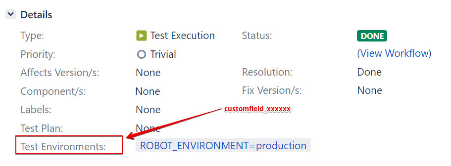

# Configuration

This document describes the configuration and customization changes which you may need to apply in order to integrate the program's output with your API environment.

- Any content in those templates following a ``REPLACE_xxxxxx_REPLACE`` pattern indicates content which will be replaced _automatically_ by the program. Unless mentioned otherwise, you don't need to apply any changes here.
- Any content which does not follow this previous naming pattern but contains ``CONFIGURE_THIS_...`` may need to get configured prior to using the program.

- Open the ``src/templates`` folder. This folder contains:
  - two ``template_jira_...`` template files
  - five ``template_robot_..`` template files

## Basic configuration (excluding Jira setup) - MANDATORY

- Edit the ``template_robot_..`` template files:
  - File ``template_robot_generic_includes.robot`` contains a placeholder for the API's base URL. Dependent on whether your OpenAPI file contains this information or not, the program will try to replace this value with the correct URL from the OpenAPI file. See function ``write_robot_framework_includes_file`` in the program for further details. In addition, you can add generic include content to this file.
  - Files ``template_robot_keyword_without_request_body.robot`` and ``template_robot_keyword_with_request_body.robot`` contain the code for sending REST requests to the API. 
    - This is where the action happens - you may need to reconfigure the API call keyword, add some post-processing logic etc.
    - The ``Send API Request``  command used in the program's template files is not present as a keyword and acts as a mere placeholder; __you need to amend this section in the program's templates__.
  - File ``template_robot_header.robot`` represents the future test's header content - read: declaration of the datadriver file, libraries etc. Normally, you don't need to apply any changes here.
  - File ``template_robot_footer.robot`` contains footer data which will be added to the generated test file at the bottom of the file. This file can contain e.g. additional keywords, declarations etc.

With the exception of ``template_robot_footer.robot``, all files are considered as mandatory content. The ``footer`` file is optional and there will be no error if the footer file cannot be found.

## Extended configuration (Jira setup) - OPTIONAL

This section is optional if you don't intend to use the Jira ticket generator.

In order to configure the extended configuration for Jira, you need to retrieve configuration values __which are specific to your JIRA installation__. Please see [this article](https://community.atlassian.com/t5/Jira-Software-questions/Project-ID-and-Custom-Field-ID-on-next-gen-project/qaq-p/1095295) for additional details. In addition, this program assumes that you [have the Jira XRay plugin installed](https://www.getxray.app/). You can still use the program without XRay support but might be required to apply small changes to both code and template files

Prerequisites for this configurationstep:

- Get your numeric Jira project ID
- Get the ``customfield_...`` value for your Jira/XRay installation's ``Test Environments`` field. Dependent on your setup, you can use this field for e.g. passing environment variables from Jira/XRay to other connected system component.
- In order to allow the program to create these tickets, you need to provide a Jira Access key to the program. Contact your administrator if necessary. The access key may look like this: ``dGVu9Y3lfcm9ib3Q6M08lKADt9vTVhnchhaUnQ9``

- Edit file ``template_jira_test_case.json``. Replace the placeholder ``CONFIGURE_THIS_SETTING_WITH_YOUR_JIRA_PROJECT_ID`` with your numeric Jira project ID. Then save the file.

Example:

    "project": {
       "id": "123456"
    },

- Edit file ``template_jira_test_execution.json``. Replace the placeholder ``CONFIGURE_THIS_SETTING_WITH_YOUR_JIRA_PROJECT_ID`` with your numeric Jira project ID. Replace the placeholder ``customfield_CONFIGURE_THIS_WITH_THE_NUMERIC_CUSTOMFIELD_ID_OF_THE_XRAY_TEST_ENVIRONMENTS_FIELD`` with your ``customfield`` value. Then save the file.

Example:

    "project": {
       "id": "123456"
    },
    ...
    "customfield_123456": ["ROBOT_ENVIRONMENT=TEST"],

As discussed earlier, the ``customfield`` value references to (external) Robot Framework environment variables which can be passed from Jira to other systems such as Jenkins.

Finally, edit the program and change the JIRA URL's base server URL:

    JIRA_SERVER_URL = "https://jira.acme.com:443"

Note that this URL is used for both 'regular' Jira operations as well as for X-Ray operations. Dependent on your Jira setup, you may need to change some subsettings in the program.

### Disable XRay support

There are two XRay dependencies which need to be amended:

- remove the ``customfield_xxxx`` reference from the file
- Amend the ``create_jira_tickets`` function in the code and disable the XRay API calls.

Have a look at the program's [command line parameters and known issues](docs/USAGE.md)